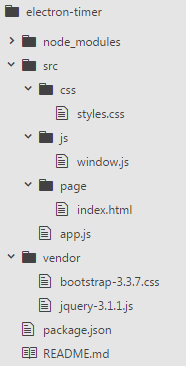
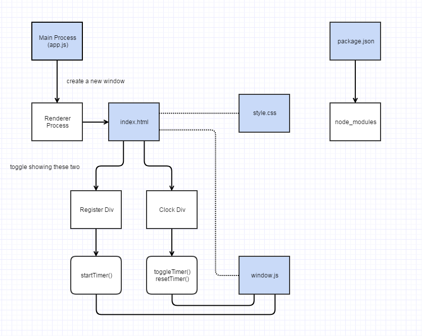

# Electron Timer

Simple one page [Electron](http://electron.atom.io) application that implements the count-down timer function.

## User Story (Minimum Requirement)

- user should be able to set up count-down time
- user should be able to start the count-down
- user should be able to stop the count-down
- user should be able to see the remaining time
- user should get alert when time is up

## File Structure

## Design

## How to Use the App

- install [Node LTS](https://nodejs.org)
- clone this repository
- `cd price`
- `npm install` to install the application's dependencies
- `npm start` to start the application

## More Features

Coming...

## References

- https://electron.atom.io/docs/tutorial/quick-start (VERY userful for getting started)
- https://www.toptal.com/javascript/electron-cross-platform-desktop-apps-easy
- https://medium.com/developers-writing/building-a-desktop-application-with-electron-204203eeb658
